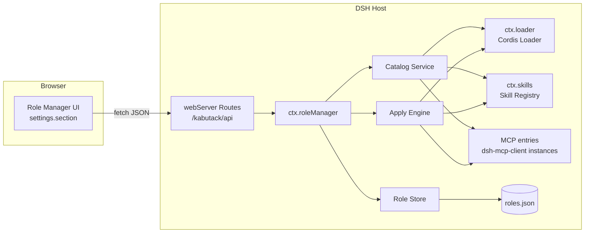
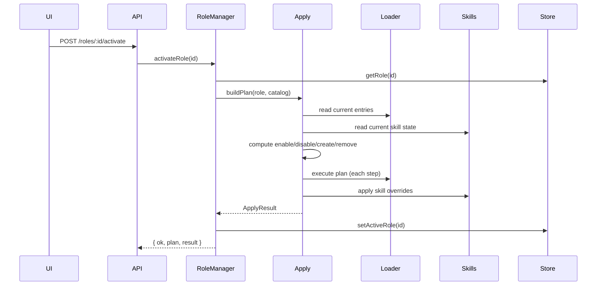

# 02 架构设计

## 1. 总览

`kabutack` 采用 DSH **hybrid 插件**形态：

- **Host 侧**：注册 `ctx.roleManager` 服务，提供 Catalog、角色 CRUD、能力启停、MCP 管理、角色激活引擎；通过 `ctx.webServer` 暴露 HTTP API 给浏览器 UI。
- **Client 侧**：通过 `ctx.slots.inject('settings.section')` 注册“角色管理”设置页，调用 Host API。



## 2. 目录结构（目标）

```text
kabutack/
├── package.json
├── tsconfig.json               # solution root（引用 Host/Client aggregate）
├── tsconfig.base.json          # Host 共享编译选项
├── tsconfig.base.client.json   # Client 浏览器编译选项
├── tsconfig.host.json          # Host aggregate
├── tsconfig.client.json        # Client aggregate
├── scripts/
│   ├── build-host.mjs          # Host 构建（Node 跨平台）
│   ├── build.sh                # Host 构建（Bash 备用）
│   ├── build-client.mjs        # Client 构建
│   ├── typecheck.mjs           # 类型检查
│   └── typecheck.sh            # 类型检查（Bash）
├── cordis.patch.yml            # 可选：patch 装配入口
├── src/
│   ├── index.ts                # 插件入口：inject/apply/config/schema
│   ├── types.ts                # 共享领域类型
│   ├── catalog.ts              # 读取 Loader/Skills/MCP 快照
│   ├── roles.ts                # 角色持久化 CRUD
│   ├── apply.ts                # 差异计算与执行/回滚引擎
│   ├── loader-ops.ts           # Loader 封装（entries/create/update/remove）
│   ├── skills-ops.ts           # 技能启停/覆盖 Provider
│   ├── mcp-ops.ts              # MCP 配置转换与 entry 管理
│   ├── api.ts                  # webServer HTTP API
│   ├── audit.ts                # 审计日志
│   └── client/
│       └── index.ts            # settings.section UI
├── lib/                        # 构建产物
└── docs/                       # 本文档
```

## 3. 模块职责

### 3.1 `catalog.ts` — 统一能力快照

- 枚举 `ctx.loader.entries()`，跳过 group entry，得到插件列表。
- 过滤 `moduleName === '@deepseek-ai/dsh-mcp-client'` 的 entry，解析出 MCP 列表。
- 调用 `ctx.skills.list()`（或 `snapshot()`）得到技能列表。
- 输出 `CatalogSnapshot`，每条带 `managed` 标记（是否属于本插件可管理范围）。

### 3.2 `roles.ts` — 角色存储

- 读写 `~/.dsh/kabutack/roles.json`。
- 提供 `listRoles/createRole/updateRole/deleteRole/getRole/setActiveRole`。
- 原子写：写临时文件 → fsync → rename。
- 文件损坏时备份为 `roles.json.bad-<timestamp>`，返回可恢复空状态。

### 3.3 `apply.ts` — 角色激活引擎

核心流程：



- `buildPlan` 生成 `ApplyPlan`：`enablePlugins`、`disablePlugins`、`createMcps`、`updateMcps`、`removeMcps`、`skillOverrides`、`warnings`。
- 执行器维护 `undoStack`，任一步抛错时按逆序回滚。
- 幂等：如果期望状态已满足，对应步骤为空。

### 3.4 `loader-ops.ts` — Loader 封装

- `listPlugins()`：遍历 `ctx.loader.entries()`。
- `setPluginEnabled(entryId, enabled)`：`ctx.loader.update(entryId, { disabled: !enabled })`。
- `createMcpEntry(def)`：`ctx.loader.create({ name: '@deepseek-ai/dsh-mcp-client', config: def })`。
- `removeEntry(entryId)`：`ctx.loader.remove(entryId)`。
- `ensureSelfProtected()`：拒绝操作本插件自身 entry。

> 注意：对“官方 bundle 插件”，本插件只做运行时启停；对由本插件持久化管理的 MCP/注入插件，才允许创建/删除。

### 3.5 `skills-ops.ts` — 技能启停

两种策略：

1. **文件系统技能**：直接修改技能目录 `SKILL.md` frontmatter：
   - 停用模型调用：`disable-model-invocation: true`
   - 停用用户调用：`user-invocable: false`
   - 启用则移除/覆盖为 `false`。
2. **运行时/第三方 Provider 技能**：注册一个高 rank 的 `SkillProvider` 覆盖层，在 `list()` 中过滤被禁用的技能。该覆盖层数据来自 `roles.json` 中的 `skillOverrides`。

### 3.6 `mcp-ops.ts` — MCP 定义管理

- 将 UI 传入的 MCP 表单转换为 `dsh-mcp-client` 的 config：
  - `{ serverName, transport: 'stdio', command, args?, env?, cwd? }`
  - `{ serverName, transport: 'streamable-http', url, headers?, toolCallTimeoutMs? }`
- 负责持久化到 `roles.json` 的 `mcps` 数组（作为可被角色引用的 MCP 定义库）。

### 3.7 `api.ts` — HTTP API

- 注册 `ctx.webServer.register({ kind: 'prefix', path: '/kabutack/api', handler })`。
- 统一响应：`{ ok: true, data }` 或 `{ ok: false, error }`。
- 所有 handler 使用 `try/catch`，错误记录审计日志。

### 3.8 `client/index.ts` — UI

- `export const inject = ['slots']`。
- `ctx.effect(() => ctx.slots.inject('settings.section', () => ctx.slots.register({...})))`。
- 页面用原生 DOM + fetch（与 `dsh-super-injector` 客户端保持一致，避免引入 React 依赖；若团队熟悉 React 也可用 `dsh-client-web-react`，但 v1 建议原生 DOM 以降低构建复杂度）。
- 包含：能力目录列表、角色列表、角色编辑器、切换按钮、操作反馈。

## 4. DSH 扩展点使用

| 扩展点 | 用途 |
|---|---|
| `ctx.loader` | 枚举/创建/更新/删除插件与 MCP entry |
| `ctx.skills` | 浏览技能；`registerProvider` 实现技能覆盖层 |
| `ctx.webServer` | 暴露 HTTP API |
| `ctx.slots`（client） | 注册设置页 UI |
| `ctx.effect` | 生命周期清理（路由、监听、provider disposer） |
| `ctx.timer`（可选） | UI 轮询/自动刷新 |

## 5. 持久化与运行时状态的关系

- **持久化真源**：`roles.json` 保存角色定义、MCP 定义、激活角色 id、技能覆盖。
- **运行时真源**：Cordis Loader 是插件/MCP 生命周期的权威；`ctx.skills` 是技能注册表的权威。
- 本插件不尝试在内存中复制 Loader 状态，每次 Catalog 都直接读取运行时。
- 角色切换时：先把期望状态写入内存/持久化，再执行 Loader 操作；操作成功后更新 `activeRoleId`。

## 6. 容错与回滚

- 每个执行步骤包装为 `{ name, run, undo }`。
- `run` 成功推入 `undoStack`；失败时逆序调用 `undo`。
- 对不可逆操作（如卸载文件系统技能到回收站），先复制/移动，`undo` 负责恢复。
- 对 Loader entry 的创建：`undo` 调用 `remove`；对删除：`undo` 重新 `create`（需要保留原始 config）。
- 如果回滚也失败，记录严重错误并保留审计现场。

## 7. 安全边界

- 所有写 API 只允许本机回环访问（`ctx.webServer` 默认安全姿态）。
- 输入校验：角色 id 使用 `[a-z0-9-]`；MCP serverName 使用 `[A-Za-z0-9_-]{1,32}`；路径必须解析到 `~/.dsh/kabutack` 或技能根目录内。
- 禁止操作 `kabutack` 自身 entry。
- 禁止删除官方 bundle 插件；只允许停用。
