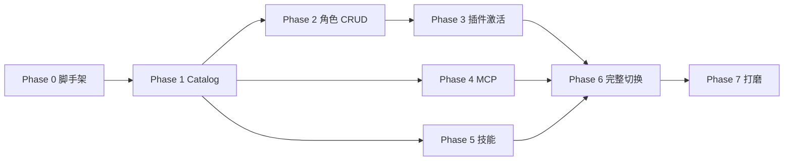

# 05 实施任务拆解

> 供 AI Coding 按阶段实现。每个阶段有明确交付物与验收标准。

## Phase 0：项目脚手架与 DSH 接入

**目标**：生成可构建、可注入的空插件骨架。

任务：

- [ ] 创建目录 `kabutack/`，使用 `dev_scaffold_plugin` 生成 `hybrid` 形态骨架，或手写：
  - `package.json`
  - `tsconfig.json`
  - `scripts/build.sh`
  - `src/index.ts`
  - `src/client/index.ts`
  - `tsdown.config.ts`
- [ ] `package.json` 关键字段：
  - `name: "@dsh-external/kabutack"`
  - `type: "module"`, `main: "./lib/index.js"`
  - `dsh.client.inject: ["@deepseek-ai/dsh-client-runtime", "@deepseek-ai/dsh-client-ui-slots"]`
  - peerDependencies: `@deepseek-ai/dsh-tools`, `cordis`, `schemastery`（版本范围参考现有插件）
- [ ] 实现一个空的 `apply(ctx)`，`export const name = 'kabutack'`。
- [ ] 运行 `dev_build_plugin` 构建成功。
- [ ] 运行 `dev_inject_plugin` 注入，`dev_plugin_status` 能看到插件。
- [ ] 客户端注册一个最小 `settings.section`“角色管理”空页面。

**验收**：插件可注入、可重载、UI 空页面出现在设置页。

## Phase 1：Catalog 快照（只读）

**目标**：能统一枚举插件、技能、MCP。

任务：

- [ ] `src/catalog.ts`：
  - 遍历 `ctx.loader.entries()`，跳过 group，映射 `PluginItem`。
  - 过滤 `moduleName === '@deepseek-ai/dsh-mcp-client'` 得到 `McpItem`，解析 config。
  - 调用 `ctx.skills.list()` 得到 `SkillItem`（必要时用 `snapshot()` 获取 description/invocation）。
  - 输出 `CatalogSnapshot`。
- [ ] `src/api.ts` 注册 `GET /kabutack/api/catalog`。
- [ ] UI“能力目录”Tab 调用并渲染列表。
- [ ] 加入搜索/筛选（前端过滤即可）。

**验收**：设置页能看到三类能力；插件/MCP 状态与 Loader 一致；技能来自 `ctx.skills`。

## Phase 2：角色 CRUD 与持久化

**目标**：角色可保存到 `roles.json`。

任务：

- [ ] `src/roles.ts`：
  - 实现原子读写 `~/.dsh/kabutack/roles.json`。
  - `listRoles/createRole/updateRole/deleteRole/duplicateRole/setActiveRole`。
  - 校验角色 id 格式与唯一性。
- [ ] `src/api.ts` 增加 `/roles` CRUD 与 `/state`。
- [ ] UI“角色”Tab 与“角色编辑器”实现。
- [ ] 添加示例数据或空状态。

**验收**：创建/编辑/删除/复制角色后刷新页面仍在；`roles.json` 内容正确；损坏文件有备份恢复。

## Phase 3：插件启停与角色激活（Loader 部分）

**目标**：角色切换能启用/停用插件。

任务：

- [ ] `src/loader-ops.ts`：
  - `setPluginEnabled(entryId, enabled)` 用 `ctx.loader.update(entryId, { disabled: !enabled })`。
  - `listEntries()` 与 `findByModuleName(moduleName)`。
- [ ] `src/apply.ts`：
  - `buildPlan(role, catalog)` 比较角色 `plugins` 与当前 `PluginItem[]`。
  - 执行 `enablePlugins` / `disablePlugins`。
  - 实现 `undoStack` 与失败回滚。
- [ ] `src/api.ts` 增加 `POST /roles/:id/activate`。
- [ ] UI 增加“激活”按钮与结果展示。

**验收**：
- 激活角色后，角色勾选的插件启用，未勾选且受管的插件停用。
- 重复激活幂等。
- 人为制造失败（如 mock 抛错）能回滚到切换前状态。

## Phase 4：MCP 管理

**目标**：能添加/编辑/删除/启停 MCP。

任务：

- [ ] `src/mcp-ops.ts`：
  - 表单 → `McpDefinition` → `ctx.loader.create({ name: '@deepseek-ai/dsh-mcp-client', config })`。
  - `updateMcp` 用 `ctx.loader.update(entryId, { config })`。
  - `removeMcp` 用 `ctx.loader.remove(entryId)`。
  - 持久化 MCP 定义库到 `roles.json.mcps`。
- [ ] `src/api.ts` 增加 `/mcps` CRUD。
- [ ] `src/apply.ts` 支持 `createMcps` / `updateMcps` / `removeMcps`。
- [ ] UI“MCP 管理”表单。

**验收**：
- 添加 stdio MCP 后，Catalog 出现新 MCP，工具名 `mcp__<serverName>__*` 可被模型使用。
- 停用/启用立即生效。
- 删除后 Loader entry 消失、定义库移除。
- 角色激活可自动创建缺失 MCP。

## Phase 5：技能管理

**目标**：能浏览、启用/停用、卸载技能。

任务：

- [ ] `src/skills-ops.ts`：
  - 对文件系统技能：读/写 `SKILL.md` frontmatter（`disable-model-invocation` / `user-invocable`）。
  - 对运行时技能：注册一个 `SkillProvider` 覆盖层，读取 `roles.json.skillOverrides` 过滤。
  - `setSkillInvocation(name, opts)`。
  - `removeSkill(name)` 把文件移动到 `~/.dsh/kabutack/trash/`。
- [ ] `src/api.ts` 增加技能启停/卸载端点。
- [ ] `src/apply.ts` 支持 `skillOverrides`。
- [ ] UI 技能列表与操作。

**验收**：
- 停用文件系统技能后，`ctx.skills.list()` 不再返回（或 invocation 变为 false）。
- 重新启用后恢复。
- 卸载后技能文件进入回收站，可从回收站手工恢复。

## Phase 6：角色切换完整闭环与恢复

**目标**：一键切换角色，重启恢复。

任务：

- [ ] `activateRole` 完整支持 plugin+skill+mcp。
- [ ] 激活成功后写 `activeRoleId`。
- [ ] `apply(ctx)` 启动时读取 `activeRoleId` 并异步自动激活（失败只记日志）。
- [ ] UI 显示“当前角色”与“上次激活失败”状态。
- [ ] 增加审计日志 `~/.dsh/kabutack/audit.log`。

**验收**：
- 从“开发者”切到“写作”，开发插件/MCP 被停用/移除，写作技能启用。
- 重启 DSH 后自动回到“写作”。
- 审计日志记录每次切换与失败原因。

## Phase 7：安全、健壮性与打磨

**目标**：达到可日常使用质量。

任务：

- [ ] 自我保护：禁止停用/卸载自身 entry；禁止删除官方 bundle 插件。
- [ ] 输入校验：所有 API 参数、路径、MCP serverName。
- [ ] 卸载确认（UI 二次确认）。
- [ ] 错误信息用户可读；回滚失败时输出现场。
- [ ] 性能：Catalog 快照避免重复同步调用；UI 轮询节流。
- [ ] 完善 README 与安装说明。

**验收**：见 [07-testing-and-acceptance.md](07-testing-and-acceptance.md)。

## 8. 任务依赖关系

